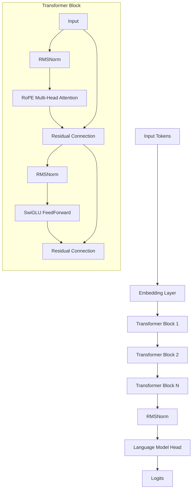

# Transformer Language Model from Scratch

[](https://opensource.org/licenses/MIT)
[](https://www.python.org/downloads/)
[](https://pytorch.org/)

A high-performance implementation of a Decoder-only Transformer Language Model, built from the ground up in PyTorch. This project serves as a deep dive into Large Language Model (LLM) architecture, featuring modern optimizations used in state-of-the-art models like Llama 2 and GPT-4.

## Key Features

### 🏗️ Advanced Architecture

- **Rotary Positional Embeddings (RoPE)**: Replaces absolute position embeddings for better relative position generalization.
- **RMSNorm (Pre-Norm)**: Improves training stability compared to LayerNorm.
- **SwiGLU Activation**: Gated Linear Unit with SiLU activation for enhanced expressivity.
- **Multi-Head Attention**: Optimized implementation for parallel head computation.

### ⚡ Optimization & Efficiency

- **Mixed Precision Training**: PyTorch AMP (BFloat16) for reduced memory usage and faster training.
- **Gradient Accumulation**: Simulates larger batch sizes on limited hardware.
- **Gradient Clipping**: Prevents exploding gradients during training.
- **Cosine Learning Rate Schedule**: Smooth decay with linear warmup for optimal convergence.

### 🛠️ Infrastructure

- **Custom Tokenizer**: Byte-Pair Encoding (BPE) trained on custom corpora.
- **Efficient Data Loading**: Uses `np.memmap` for seamless disk-based data streaming (zero-copy).
- **Experiment Tracking**: Built-in logging for loss curves and generation samples.

## Quick Start

### Prerequisites

Install dependencies using `uv` (recommended) or `pip`:

```bash
# Using uv (fast, modern)
uv sync

# OR using pip
pip install -r requirements.txt
```

### 1. Data Preparation

To train a small model on the **TinyStories** dataset:

```bash
# Download and tokenize data
uv run scripts/prepare_data.py
```

### 2. Training

Run the training pipeline. The default configuration trains a ~15M parameter model.

```bash
# Train on CPU/MPS/CUDA automatically
uv run scripts/train_quick.sh
```

### 3. Text Generation

Generate text using your trained checkpoint:

```bash
uv run run_generation.py \
    --checkpoint checkpoints_quick/step_1000.pt \
    --temperature 0.8 \
    --top_p 0.9
```

## Architecture Details

The model follows the standard Decoder-only Transformer architecture with modern tweaks:



## Experiments

This repository includes scripts for several ablation studies to verify design choices:

- **`scripts/ablation_norm.sh`**: Demonstrates training instability when RMSNorm is removed.
- **`scripts/ablation_postnorm.sh`**: Compares Pre-Norm vs. Post-Norm convergence.
- **`scripts/ablation_nope.sh`**: Shows the necessity of Positional Embeddings (RoPE vs. NoPE).

## Implemented Components for Review

This project is a **from-scratch** implementation, meaning reliance on external libraries like `transformers` is minimized. The following components were manually implemented:

1.  **Byte-Pair Encoding (BPE) Tokenizer**: Full implementation of the tokenizer training and encoding logic.
2.  **Transformer Language Model**: Decoder-only architecture with RoPE, SwiGLU, and RMSNorm.
3.  **Optimization**: Manual implementation of `AdamW` optimizer and `CrossEntropy` loss (for educational depth).
4.  **Training Loop**: Custom loop with support for:
    - Gradient Accumulation & Clipping
    - Mixed Precision (AMP)
    - Checkpoint Serialization/Loading
    - Experiment Logging

## Supported Workflows

The codebase supports the full LLM lifecycle:

1.  **Tokenization**: Train a BPE tokenizer on raw text (e.g., TinyStories) and serialize to binary format.
2.  **Training**: Train the Transformer LM on tokenized datasets (TinyStories, OpenWebText).
3.  **Generation**: Sample text from the trained model using Temperature and Top-p sampling.
4.  **Scaling**: Scale up training to larger datasets (OpenWebText) to observe loss scaling laws.

### Scale to OpenWebText

To train on the larger, noisier OpenWebText dataset:

```bash
# 1. Prepare OpenWebText Sample (50M tokens)
uv run scripts/prepare_owt.py

# 2. Run Training
uv run scripts/train_owt.sh
```

## Future Roadmap

- [ ] Implement Key-Value (KV) Caching for faster inference.
- [ ] Integrate FlashAttention-2 for longer context windows.
- [ ] Add Distributed Data Parallel (DDP) for multi-GPU training.
- [ ] Scale up to 125M parameters on OpenWebText.

## License

MIT License. Free for educational and personal use.
